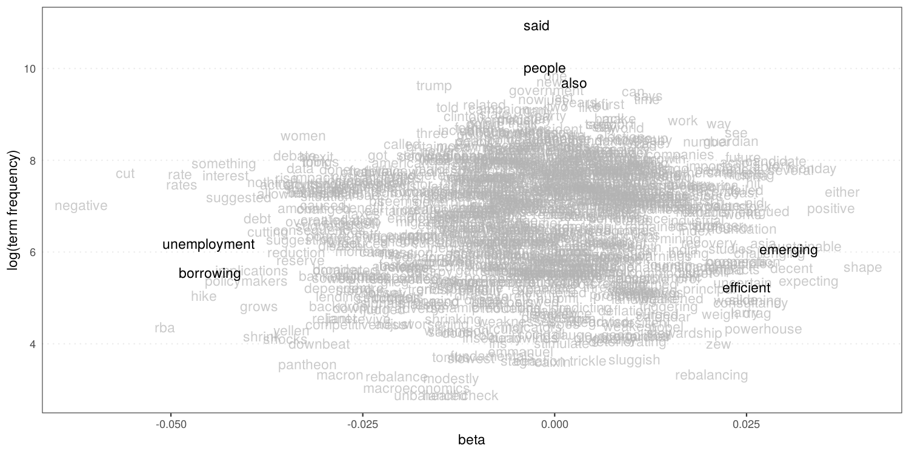

# Latent Semantic Scaling

In machine learning, the cost for users to train a model and the control
they have over its outputs usually correlate: supervised models are high
in control but high in cost; unsupervised models are low in cost but low
in control. However, social social scientists have to perform analysis
based on existing theories and concepts with very limited computational,
financial and human resources.

LSS is a semi-supervised document scaling model developed by Kohei
Watanabe to perform large scale analysis of textual data by keeping the
balance between the cost and control for [his PhD
thesis](http://etheses.lse.ac.uk/3658/). Taking pre-defined *seed words*
as weak supervision, it estimates word parameters in a latent semantic
space.

This model has been used for large scale analysis of media content in
recent research projects:

  - Kohei Watanabe, 2017. “[Measuring News Bias: Russia’s Official News
    Agency ITAR-TASS’s Coverage of the Ukraine
    Crisis](http://journals.sagepub.com/eprint/TBc9miIc89njZvY3gyAt/full)”,
    *European Journal Communication*
  - Kohei Watanabe, 2017. “[The spread of the Kremlin’s narratives by a
    western news agency during the Ukraine
    crisis](http://www.tandfonline.com/eprint/h2IHsz2YKce6uJeeCmcd/full)”,
    *Journal of International Communication*
  - Tomila Lankina and Kohei Watanabe. 2017. ["Russian Spring’ or
    ‘Spring Betrayal’? The Media as a Mirror of Putin’s Evolving
    Strategy in
    Ukraine](http://www.tandfonline.com/eprint/tWik7KDfsZv8C2KeNkI5/full)",
    *Europe-Asia Studies*

## How to install

``` r
devtools::install_github("koheiw/LSS")
```

## How to use

LSS estimates semantic similarity of words based on their surrounding
contexts, so a LSS model should be trained on data where the text unit
is sentence. It is also affected by noises in data such as function
words and punctuation marks, so they should also be removed. It requires
larger corpus of texts (5000 or more documents) to accurately estimate
semantic proximity. The [sample
corpus](https://www.dropbox.com/s/kfhdoifes7z7t6j/data_corpus_guardian2016-10k.RDS?dl=1)
contains 10,000 Guardian news articles from 2016.

### Fit a LSS model

``` r
require(quanteda)
require(LSS)
```

``` r
corp <- readRDS("/home/kohei/Dropbox/Public/data_corpus_guardian2016-10k.rds")

toks_sent <- corp %>% 
    corpus_reshape("sentences") %>% 
    tokens(remove_punct = TRUE) %>% 
    tokens_remove(stopwords(), padding = TRUE)
dfmt_sent <- toks_sent %>% 
    dfm(remove = "") %>% 
    dfm_select("^\\p{L}+$", valuetype = "regex", min_nchar = 2) %>% 
    dfm_trim(min_termfreq = 5)

eco <- char_keyness(toks_sent, "econom*", p = 0.05)
tmod_lss <- textmodel_lss(dfmt_sent, seedwords('pos-neg'), feature = eco, cache = TRUE)
```

    ## Writing cache file: lss_cache/svds_60960635d75c271b.RDS

### Sentiment seed words

Seed words are 14 generic sentiment
    words.

``` r
seedwords("pos-neg")
```

    ##        good        nice   excellent    positive   fortunate     correct 
    ##           1           1           1           1           1           1 
    ##    superior         bad       nasty        poor    negative unfortunate 
    ##           1          -1          -1          -1          -1          -1 
    ##       wrong    inferior 
    ##          -1          -1

### Sentiment words

LSS identifies domain specific words and weight them by
    sentiment.

``` r
head(coef(tmod_lss), 20) # most positive words
```

    ##       legal    positive   expecting    emerging        able   professor 
    ##  0.04205670  0.04198759  0.04041890  0.03913838  0.03768802  0.03453550 
    ## sustainable      monday      decent      oxford         aid       stock 
    ##  0.03438302  0.03376070  0.03208933  0.03161188  0.03156961  0.03147390 
    ##  principles       shape        prof    northern    academic     markets 
    ##  0.03035493  0.03016979  0.03014006  0.02992693  0.02986570  0.02947902 
    ##         nhs      either 
    ##  0.02922554  0.02915907

``` r
tail(coef(tmod_lss), 20) # most negative words
```

    ##         rise       impact     pantheon implications      cutting 
    ##  -0.03495389  -0.03535304  -0.03546813  -0.03565484  -0.03590826 
    ##     downbeat         debt    dominated     interest    suggested 
    ##  -0.03597810  -0.03636211  -0.03700214  -0.03762701  -0.03864661 
    ##     suggests    something       happen         hike    borrowing 
    ##  -0.03928283  -0.04008333  -0.04076961  -0.04396055  -0.04549552 
    ##        rates         rate unemployment          rba     negative 
    ##  -0.04638569  -0.04689606  -0.04810378  -0.05048054  -0.06004318

## Result of analysis

In the plots, circles indicate sentiment of individual news articles and
lines are their local average (solid line) with a confidence band
(dotted lines). According to the plot, economic sentiment in the
Guardian news stories became negative from February to April, but it
become more positive in April. As the referendum approaches, the
newspaper’s sentiment became less stable, although it became close to
neutral (overall mean) on the day of voting (broken line).

``` r
dfmt <- dfm(corp)

# predict sentiment scores
pred <- as.data.frame(predict(tmod_lss, se.fit = TRUE, newdata = dfmt))
pred$date <- docvars(dfmt, "date")
pred <- na.omit(pred)

# smooth LSS scores
pred_sm <- smooth_lss(pred, from = as.Date("2016-01-01"), to = as.Date("2016-12-31"))

# plot trend
plot(pred$date, pred$fit, col = rgb(0, 0, 0, 0.05), pch = 16, ylim = c(-0.5, 0.5),
     xlab = "Time", ylab = "Negative vs. positive", main = "Economic sentiment in the Guardian")
lines(pred_sm$date, pred_sm$fit, type = "l")
lines(pred_sm$date, pred_sm$fit + pred_sm$se.fit * 2, type = "l", lty = 3)
lines(pred_sm$date, pred_sm$fit - pred_sm$se.fit * 2, type = "l", lty = 3)
abline(h = 0, v = as.Date("2016-06-23"), lty = c(1, 2))
text(as.Date("2016-06-23"), 0.4, "Brexit referendum")
```

<!-- -->
