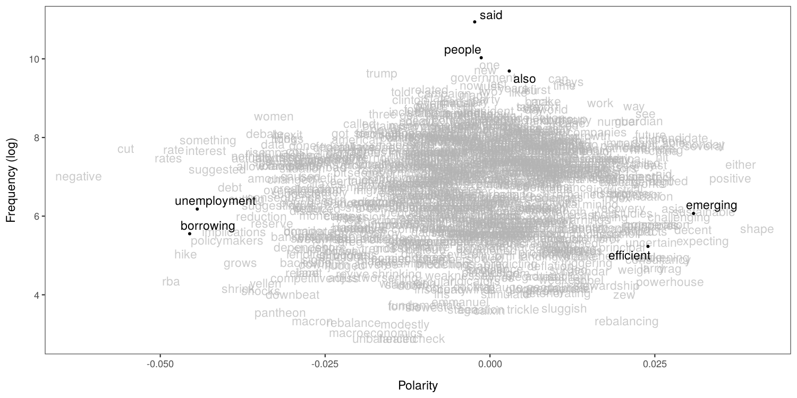

# Latent Semantic Scaling

**NOTICE:** This R package is renamed from **LSS** to **LSX** for CRAN
submission.

In quantitative text analysis, the cost to train supervised machine
learning models tend to be very high when the corpus is large. LSS is a
semisupervised document scaling method that I developed to perform large
scale analysis at low cost. Taking user-provided *seed words* as weak
supervision, it estimates polarity of words in the corpus by latent
semantic analysis and locates documents on a unidimensional scale
(e.g. sentiment).

I used LSS for large scale analysis of media content in several research
projects:

  - Kinoshita, Hiroko. 2020. [“A Quantitative Text Analysis Approach on
    LGBTQ Issues in Contemporary
    Indonesia”](https://so03.tci-thaijo.org/index.php/jpss/article/view/241133).
    *Journal of Population and Social Studies*.
  - Yamao, Dai. 2020. [“Re-securitization as Evasion of Responsibility:
    A Quantitative Text Analysis of Refugee Crisis in Major Arabic
    Newspapers”](https://so03.tci-thaijo.org/index.php/jpss/article/view/241130),
    *Journal of Population and Social Studies*.
  - Watanabe, Kohei. 2017. [“Measuring News Bias: Russia’s Official News
    Agency ITAR-TASS’s Coverage of the Ukraine
    Crisis”](http://journals.sagepub.com/eprint/TBc9miIc89njZvY3gyAt/full),
    *European Journal Communication*.
  - Watanabe, Kohei. 2017. [“The spread of the Kremlin’s narratives by a
    western news agency during the Ukraine
    crisis”](http://www.tandfonline.com/eprint/h2IHsz2YKce6uJeeCmcd/full)",
    *Journal of International Communication*.
  - Lankina, Tomila and Watanabe, Kohei. 2017. [“‘Russian Spring’ or
    ‘Spring Betrayal’? The Media as a Mirror of Putin’s Evolving
    Strategy in
    Ukraine”](http://www.tandfonline.com/eprint/tWik7KDfsZv8C2KeNkI5/full),
    *Europe-Asia Studies*.

Please read my paper for the algorithm and methodology:

  - Watanabe, Kohei. 2020. “[Latent Semantic Scaling: A Semisupervised
    Text Analysis Technique for New Domains and
    Languages](https://www.tandfonline.com/doi/full/10.1080/19312458.2020.1832976)”,
    *Communication Methods and Measures*.

## How to install

``` r
devtools::install_github("koheiw/LSX")
```

## How to use

LSS estimates semantic similarity of words based on their surrounding
contexts, so a LSS model should be trained on data where the text unit
is sentence. It is also affected by noises in data such as function
words and punctuation marks, so they should also be removed. It requires
larger corpus of texts (5000 or more documents) to accurately estimate
semantic proximity. The [sample corpus](https://bit.ly/2GZwLcN) contains
10,000 Guardian news articles from 2016.

### Fit a LSS model

``` r
require(quanteda)
require(LSX) # changed from LSS to LSX
```

``` r
corp <- readRDS(url("https://bit.ly/2GZwLcN", "rb"))
```

``` r
toks_sent <- corp %>% 
    corpus_reshape("sentences") %>% 
    tokens(remove_punct = TRUE) %>% 
    tokens_remove(stopwords("en"), padding = TRUE)
dfmt_sent <- toks_sent %>% 
    dfm(remove = "") %>% 
    dfm_select("^\\p{L}+$", valuetype = "regex", min_nchar = 2) %>% 
    dfm_trim(min_termfreq = 5)

eco <- char_context(toks_sent, "econom*", p = 0.05)
lss <- textmodel_lss(dfmt_sent, as.seedwords(data_dictionary_sentiment),
                     terms = eco, k = 300, cache = TRUE)
```

    ## Writing cache file: lss_cache/svds_8db7aff46eb4a7f7.RDS

### Sentiment seed words

Seed words are 14 generic sentiment words.

``` r
data_dictionary_sentiment
```

    ## Dictionary object with 2 key entries.
    ## - [positive]:
    ##   - good, nice, excellent, positive, fortunate, correct, superior
    ## - [negative]:
    ##   - bad, nasty, poor, negative, unfortunate, wrong, inferior

### Economic sentiment words

Economic words are weighted in terms of sentiment based on the proximity
to seed words.

``` r
head(coef(lss), 20) # most positive words
```

    ##       shape      either    positive     several sustainable      monday 
    ##  0.04050151  0.03805443  0.03643996  0.03248623  0.03244807  0.03240911 
    ##   expecting    emerging      decent   candidate challenging        york 
    ##  0.03229806  0.03086714  0.03079337  0.02899715  0.02867746  0.02791129 
    ##        able        asia       thing  powerhouse        drag      argued 
    ##  0.02787632  0.02772680  0.02733644  0.02727044  0.02715067  0.02712570 
    ##         aid       china 
    ##  0.02640394  0.02634768

``` r
tail(coef(lss), 20) # most negative words
```

    ##     actually      nothing        allow      cutting        grows       shrink 
    ##  -0.03599093  -0.03620681  -0.03629741  -0.03694543  -0.03784115  -0.03813461 
    ## implications         debt policymakers    suggested    something     interest 
    ##  -0.03883518  -0.03948326  -0.03985111  -0.04133722  -0.04274804  -0.04315672 
    ## unemployment    borrowing         hike         rate          rba        rates 
    ##  -0.04439511  -0.04554508  -0.04612325  -0.04799337  -0.04836243  -0.04877024 
    ##          cut     negative 
    ##  -0.05523845  -0.06236406

This plot shows that frequent words (“said”, “people”, “also”) are
neutral while less frequent words such as “borrowing”, “unemployment”,
“emerging” and “efficient” are either negative or positive.

``` r
textplot_terms(lss, 
               highlighted = c("said", "people", "also",
                               "borrowing", "unemployment",
                               "emerging", "efficient"))
```

<!-- -->

## Result of analysis

In the plots, circles indicate sentiment of individual news articles and
lines are their local average (solid line) with a confidence band
(dotted lines). According to the plot, economic sentiment in the
Guardian news stories became negative from February to April, but it
become more positive in April. As the referendum approaches, the
newspaper’s sentiment became less stable, although it became close to
neutral (overall mean) on the day of voting (broken line).

``` r
dfmt <- dfm(corp)

# predict sentiment scores
pred <- as.data.frame(predict(lss, se.fit = TRUE, newdata = dfmt))
pred$date <- docvars(dfmt, "date")

# smooth LSS scores
pred_sm <- smooth_lss(pred, from = as.Date("2016-01-01"), to = as.Date("2016-12-31"))

# plot trend
plot(pred$date, pred$fit, col = rgb(0, 0, 0, 0.05), pch = 16, ylim = c(-0.5, 0.5),
     xlab = "Time", ylab = "Negative vs. positive", main = "Economic sentiment in the Guardian")
lines(pred_sm$date, pred_sm$fit, type = "l")
lines(pred_sm$date, pred_sm$fit + pred_sm$se.fit * 2, type = "l", lty = 3)
lines(pred_sm$date, pred_sm$fit - pred_sm$se.fit * 2, type = "l", lty = 3)
abline(h = 0, v = as.Date("2016-06-23"), lty = c(1, 2))
text(as.Date("2016-06-23"), 0.4, "Brexit referendum")
```

<!-- -->
